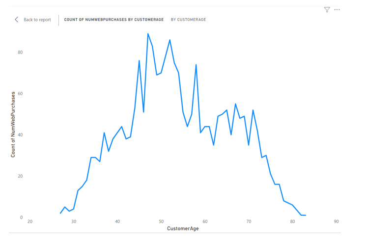
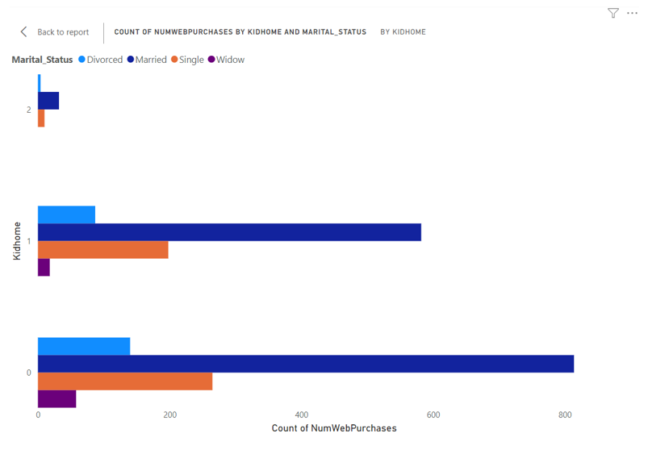
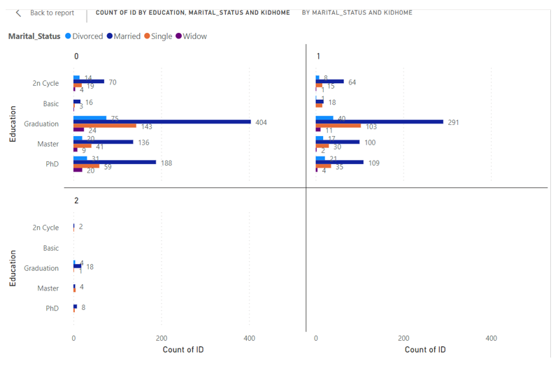
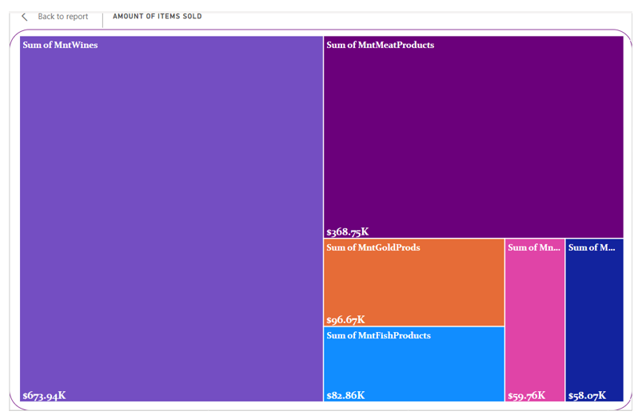
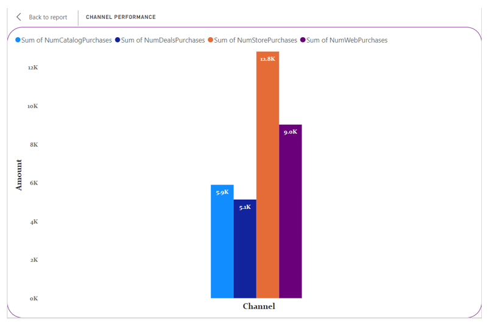
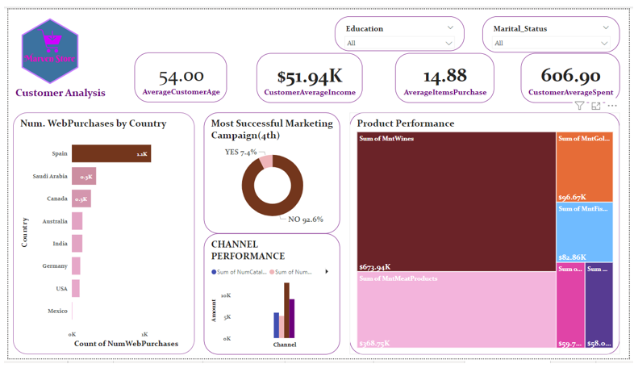

# EXPLORATORY REPORT: Customer Analysis Mavern Store Marketing Campaign

---

## Executive Summary 
This exploratory report delves into the customer data of Mavern Company's recent marketing campaign. By examining factors related to web purchases, identifying the most successful campaign, profiling the average customer, evaluating product performance, and assessing channel effectiveness, offering insights to enhance future marketing strategies.

## Introduction
This report analyzes customer data from Mavern Company's marketing campaign to uncover trends and relationships that drive web purchases, highlight successful strategies, and optimize marketing efforts. 

## Methodology
Data was collected from customer profiles, campaign logs, and purchase records. Exploratory data analysis techniques were employed, and visual representations were created for enhanced comprehension. Prior to analysis, the data was clean by removing null rows which was less than 1%, one outlier value was also deleted from the income column, the married column was re-organized for label consistency, and finally, outdated data were not consider in the yearBirth column. The analysis was performed using Power BI. 

### Factors Influencing Web Purchases

---

*Figure 1: Number of Web Purchase by Customer Age
Figure 1: The line chart displays trend between customer age and web purchases. This shows a fair-relationships, hence, the customers with age greater than 58 make use of the web channel lesser*. 

---

*Figure 2: This also shows factors that affect the number of web purchase, this shows that married couple without kids make use of the web channel in purchasing*.

## Most Successful Marketing Campaign

---

*Figure 2: Comparison Among Campaigns 
Figure 2: Tables compare the number of accepted among different marketing campaigns. The fourth Campaign stands out with the highest number of accepted customers on the first approach, indicating its effectiveness in driving customer actions*.

## Customer Profile

---

*Figure 3: Customer Demographic Snapshot 
Figure 3: Customer Demographic Snapshot clustered bar chart showcases a snapshot of customer demographics. The majority of customers are aged 54year averagely, primarily married, and a graduate (First degree)*.

## Best Performing Products: 

---

*Figure 4: Top Selling Products and Categories 
Figure 4: A Treemap highlights the top-selling products during the campaign. Wines and Meat products are the best performers in terms of amount generated from each product*. 

## Underperforming Channels 

---

*Figure 5: Channel Performance Comparison 
Figure 5: A clustered column chart compares channel performance in terms of total amount generated from each channel. Discounted purchases exhibits underperformance*. 

## Insights
*Factors positively correlated with web purchases include customer age, country, and marital status, which shows that Spain, married customer with no kid has the highest number of web purchases. The fourth campaign demonstrates the highest number of acceptances, making it the most successful strategy. The average customer is married, average age 54, and graduate (first degree). Wines and Meat products are top performers in terms of sales. Discounted purchase channel requires optimization to improve engagement and conversion rates*. 

## Recommendations
*Incorporate personalized recommendations to drive web purchases further. Emulate the strategies of the fourth Campaign in future campaigns for higher conversion rates. Tailor marketing efforts to resonate with the Spain, married demographic. Allocate resources to promote Wines and Meat products due to their popularity. Reevaluate strategies for Discounted purchase Channel to enhance its performance*. 

## Conclusion
*Through comprehensive customer analysis, this report uncovers valuable insights that guide future marketing endeavors. Understanding purchase factors, campaign success, customer profiles, product performance, and channel effectiveness will aid in formulating targeted and impactful strategies*. 

## DASHBOARD

---

---

